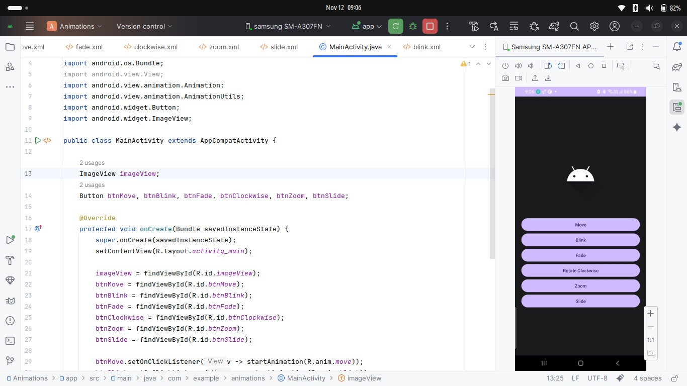
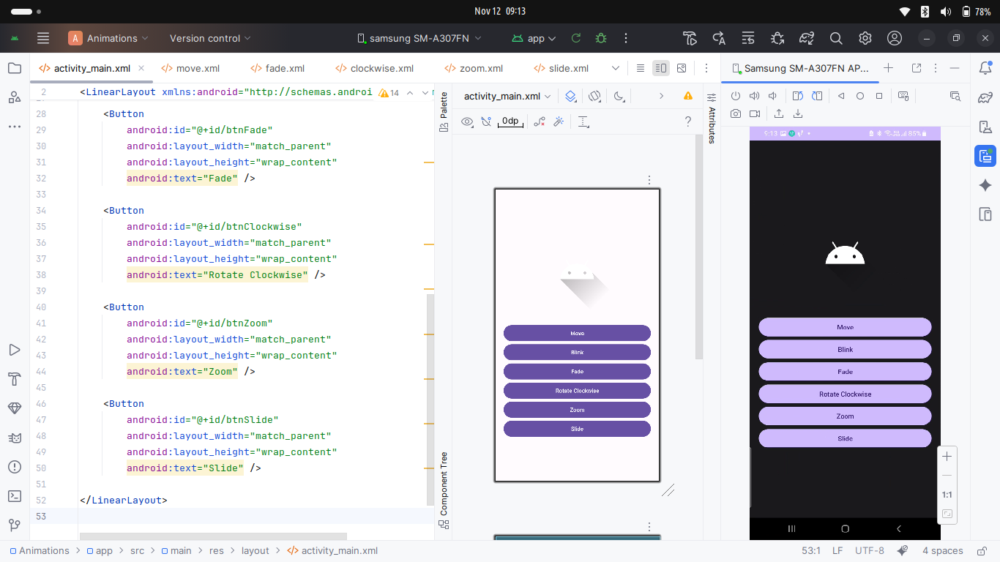
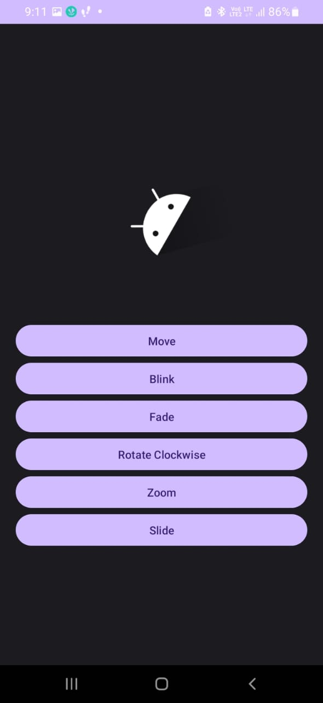

# Ex.No: 6 Develop a application to add animations to ImageView,Move,blink,fade,clockwise,zoom,slide operations are perform in android studio.

## AIM:

To develop a application to add animation to imageview,move,blink,fade,clockwise,zoom,slide operation using Android Studio.

## EQUIPMENTS REQUIRED:

Android Studio(Latest Version)

## ALGORITHM:

Step 1: Open Android Studio and then click on File → New → New Project.

Step 2: Then type the Application name as “Animation” and click Next.

Step 3: Then select the Minimum SDK as required and click Next.

Step 4: Then select the Empty Activity and click Next. Finally, click Finish.

Step 5: Design the layout in activity_main.xml with an ImageView and buttons for Move, Blink, Fade, Clockwise, Zoom, and Slide animations.

Step 6: Create separate animation XML files inside the res/anim/ folder for each animation and implement the logic in MainActivity.java to load and start each animation using AnimationUtils.

Step 7: Save and run the application to see different animations applied to the ImageView.

## PROGRAM:

```
/*
Program to display animation operation”.
Developed by: Vishwaraj G
Registeration Number : 212223220125
*/

package com.example.animations;

import androidx.appcompat.app.AppCompatActivity;
import android.os.Bundle;
import android.view.View;
import android.view.animation.Animation;
import android.view.animation.AnimationUtils;
import android.widget.Button;
import android.widget.ImageView;

public class MainActivity extends AppCompatActivity {

    ImageView imageView;
    Button btnMove, btnBlink, btnFade, btnClockwise, btnZoom, btnSlide;

    @Override
    protected void onCreate(Bundle savedInstanceState) {
        super.onCreate(savedInstanceState);
        setContentView(R.layout.activity_main);

        imageView = findViewById(R.id.imageView);
        btnMove = findViewById(R.id.btnMove);
        btnBlink = findViewById(R.id.btnBlink);
        btnFade = findViewById(R.id.btnFade);
        btnClockwise = findViewById(R.id.btnClockwise);
        btnZoom = findViewById(R.id.btnZoom);
        btnSlide = findViewById(R.id.btnSlide);

        btnMove.setOnClickListener(v -> startAnimation(R.anim.move));
        btnBlink.setOnClickListener(v -> startAnimation(R.anim.blink));
        btnFade.setOnClickListener(v -> startAnimation(R.anim.fade));
        btnClockwise.setOnClickListener(v -> startAnimation(R.anim.clockwise));
        btnZoom.setOnClickListener(v -> startAnimation(R.anim.zoom));
        btnSlide.setOnClickListener(v -> startAnimation(R.anim.slide));
    }

    private void startAnimation(int animResId) {
        Animation animation = AnimationUtils.loadAnimation(getApplicationContext(), animResId);
        imageView.startAnimation(animation);
    }
}
```

## OUTPUT

#### Coding Part



#### Design Part



#### App Image


#### Animation Image



## RESULT
Thus an application to add animation to imageview,move,blink,fade,clockwise,zoom,slide operation using Android Studio is developed and executed successfully. 